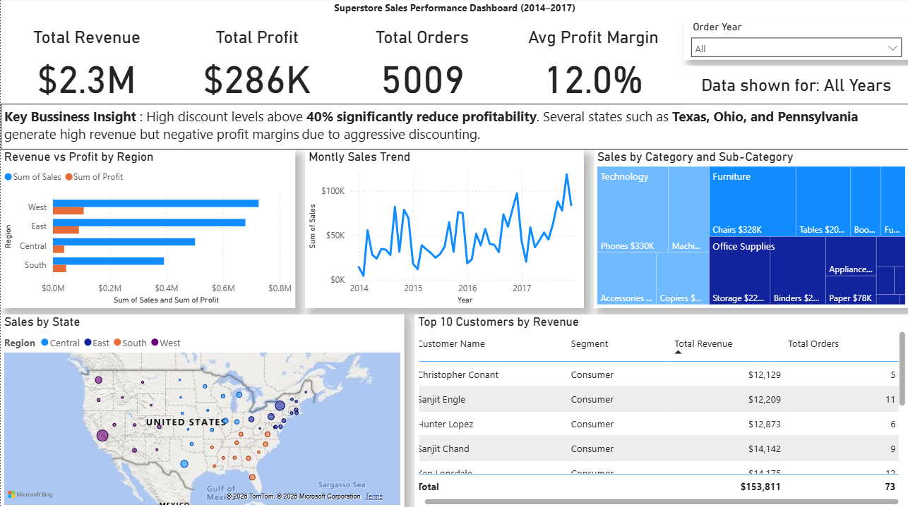

# 📊 Superstore Sales Performance Dashboard

**Workflow:** Excel (cleaning) → SQL (analysis) → Power BI (dashboard)

---

## 📋 The Business Problem

A retail company with operations across the US needed to understand why certain 
regions and product categories were losing money despite strong sales volume. 
This project identifies where revenue is leaking and recommends specific actions.

---

## 🛠️ Tools Used

| Tool | Purpose |
|------|---------|
| Excel | Data cleaning & preprocessing |
| SQL Server | Business queries & insights |
| Power BI | Interactive dashboard |

---

## 📁 Dataset

- **Source:** [Kaggle Superstore Dataset](https://www.kaggle.com/datasets/vivek468/superstore-dataset-final)
- **Size:** ~10,000 rows
- **Fields:** Orders, Sales, Profit, Discount, Customer, Region, State

---

## 📸 Dashboard Preview



---

## 🔍 Key Business Insights

- High discounts (40%+) **significantly hurt profitability** across all regions
- **Texas, Ohio & Pennsylvania** show high sales but **negative profit**
- Technology is the highest revenue-generating category
- Top 10 customers contribute a disproportionate share of revenue

---

## 💡 Business Recommendation

Discount rates above 40% consistently result in negative profit margins across 
all regions. **Immediate action:** cap discounts at 20% for Furniture and Office 
Supplies categories in Texas, Ohio, and Pennsylvania — these three states alone 
show $50K+ in losses despite strong sales volume.

---

## 🧠 SQL Analysis Covers

| # | Business Question |
|---|-------------------|
| 1 | Revenue & profit by region |
| 2 | Most/least profitable categories |
| 3 | Monthly sales trend (2014–2017) |
| 4 | Revenue by customer segment |
| 5 | Loss-making states |
| 6 | Discount impact on profitability |
| 7 | Top 10 customers by revenue |

📄 Queries: [`sql/analysis_queries.sql`](sql/analysis_queries.sql)

---

## 📂 Project Structure

```text
superstore-sales-dashboard/
├── dataset/
│   ├── Superstore_raw.csv
│   └── Superstore_mysql.csv
├── sql/
│   └── analysis_queries.sql
├── dashboard/
│   ├── dashboard.png
│   └── sales_dashboard.pbix
└── README.md

---

## ▶️ How to Run

1. Download dataset from `dataset/Superstore_mysql.csv`
2. Import into MySQL using Table Data Import Wizard
3. Run queries from `sql/analysis_queries.sql`
4. Open `dashboard/sales_dashboard.pbix` in Power BI Desktop

---

## 👤 Author

**Sai Koushik Jodu** — Aspiring Data Analyst | SQL • Python • Power BI  
[LinkedIn](https://www.linkedin.com/in/jodusaikoushik) | [GitHub Portfolio](https://github.com/jodusaikoushik-hash)
