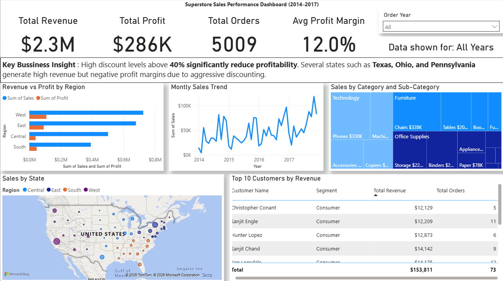

# 📊 Superstore Sales Performance Dashboard

**Workflow:** Excel (cleaning) → SQL (analysis) → Power BI (dashboard)

---

## 📋 The Business Problem

A retail company with operations across the US needed to understand why certain 
regions and product categories were losing money despite strong sales volume. 
This project identifies where revenue is leaking and recommends specific actions.

---

## 🛠️ Tools Used

| Tool | Purpose |
|------|---------|
| Excel | Data cleaning & preprocessing |
| SQL Server | Business queries & insights |
| Power BI | Interactive dashboard |

---

## 📁 Dataset

- **Source:** [Kaggle Superstore Dataset](https://www.kaggle.com/datasets/vivek468/superstore-dataset-final)
- **Size:** ~10,000 rows
- **Fields:** Orders, Sales, Profit, Discount, Customer, Region, State

---

**Data Preparation (Excel):**
- Removed blank rows and standardized date formats
- Added `Profit_Margin_%` column: `= Profit/Sales × 100`
- Added `Delivery_Days` column: `= Ship Date − Order Date`

---

## ❓ Business Questions Answered

1. Which region generates the highest revenue and profit?
2. Which product category is most/least profitable?
3. What is the monthly sales trend over 4 years?
4. Which customer segment drives the most revenue?
5. Which states have high sales but negative profit?
6. How do discount levels impact profitability?
7. Who are the Top 10 customers by revenue?
8. What share of total revenue do the Top 10 customers contribute?

---

## 📸 Dashboard Preview


*Dashboard showing All Years view. Hover over map bubbles to see 
state-level profit/loss. Year slicer filters all visuals simultaneously.*

---

## 🔍 Key Business Insights

- Revenue shows **consistent year-over-year growth** from 2014–2017
  with visible Q4 seasonal peaks each year
- **Consumer segment drives 50% of total revenue** ($1.16M) through 
  volume — 409 customers vs Corporate's 236 — though revenue per 
  customer is nearly identical across all three segments (~$2,900)
- SQL identifies **10 states with negative profit** despite strong 
  sales — Texas (−$25.7K), Pennsylvania (−$15.6K), and Ohio (−$17.0K) 
  are the top 3 by loss magnitude
- Technology is the highest revenue-generating category
- High-discount orders (40%+) show an average margin of **−109%** — 
  meaning the business loses more than the sale value on every such 
  order; 933 orders fall in this band
- Top 10 customers average **~$15.4K each — over 5x** the dataset 
  average of ~$2,900; Sean Miller (Home Office) leads at $25K with 
  just 5 orders

---

## 💡 Business Recommendation

Discount rates above 40% consistently result in negative profit margins 
across all regions — 933 orders in this band show an average margin of 
−109%. **Immediate action:** cap discounts at 20% for Furniture and 
Office Supplies in Texas, Ohio, and Pennsylvania — these three states 
show the largest losses ($25.7K, $17.0K, and $15.6K respectively) 
despite strong sales volume.

---

## 🧠 SQL Analysis Covers

| # | Business Question |
|---|---|
| 1 | Revenue & profit by region |
| 2 | Most/least profitable categories |
| 3 | Monthly sales trend (2014–2017) |
| 4 | Revenue by customer segment |
| 5 | Loss-making states |
| 6 | Discount impact on profitability (CTE) |
| 7 | Top 10 customers by revenue |
| 8 | Top 10 customer revenue concentration (% of total) |

📄 Queries: [`sql/analysis_queries.sql`](sql/analysis_queries.sql)

---

## 📂 Project Structure

```
superstore-sales-dashboard/
├── dataset/
│   ├── Superstore_raw.csv
│   └── Superstore_mysql.csv
├── sql/
│   └── analysis_queries.sql
├── dashboard/
│   ├── dashboard.png
│   └── sales_dashboard.pbix
└── README.md
```
---

## ▶️ How to Run

1. Download dataset from `dataset/Superstore_mysql.csv`
2. Import into SQL Server using SQL Server Management Studio (SSMS) — Import Flat File Wizard
3. Run queries from `sql/analysis_queries.sql`
4. Open `dashboard/sales_dashboard.pbix` in Power BI Desktop

---

## 👤 Author

**Sai Koushik Jodu** —  Data Analyst | SQL • Python • Power BI  
[LinkedIn](https://www.linkedin.com/in/jodusaikoushik) | [GitHub Portfolio](https://github.com/jodusaikoushik-hash)


